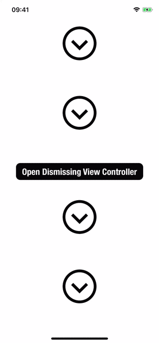

# SliderForDismissing
Demonstrates dismissing a view controller by using custom IBDesignable vertical slider. 

You can see the detailed explanation on my post

https://medium.com/@mkeremkeskin/ibdesignable-custom-vertical-slider-on-ios-f0169c2d1bdb